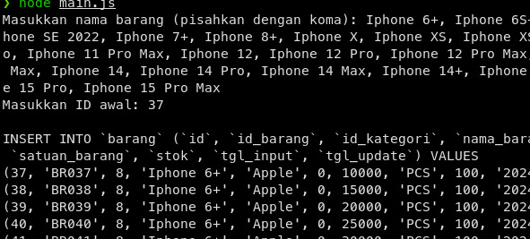

## SQL INSERT GENERATOR

A simple tool to generate SQL `INSERT` statements for product entries in an inventory database. This tool allows users to input multiple product names and their starting IDs, automatically generating a range of prices from 10,000 to 65,000 with a specified increment.

## Features

- Input multiple product names at once.
- Automatically generates product IDs based on a starting ID.
- Prices automatically range from 10,000 to 65,000 with a defined increment.
- Outputs SQL `INSERT` statements ready for use.

## How to Use

1. **Clone the repository**:
   ```bash
   git clone https://github.com/VernSG/SQL-Insert-Generator.git
   cd SQL-Insert-Generator

2. **Run**
   ```bash
   node main.js

## Example

